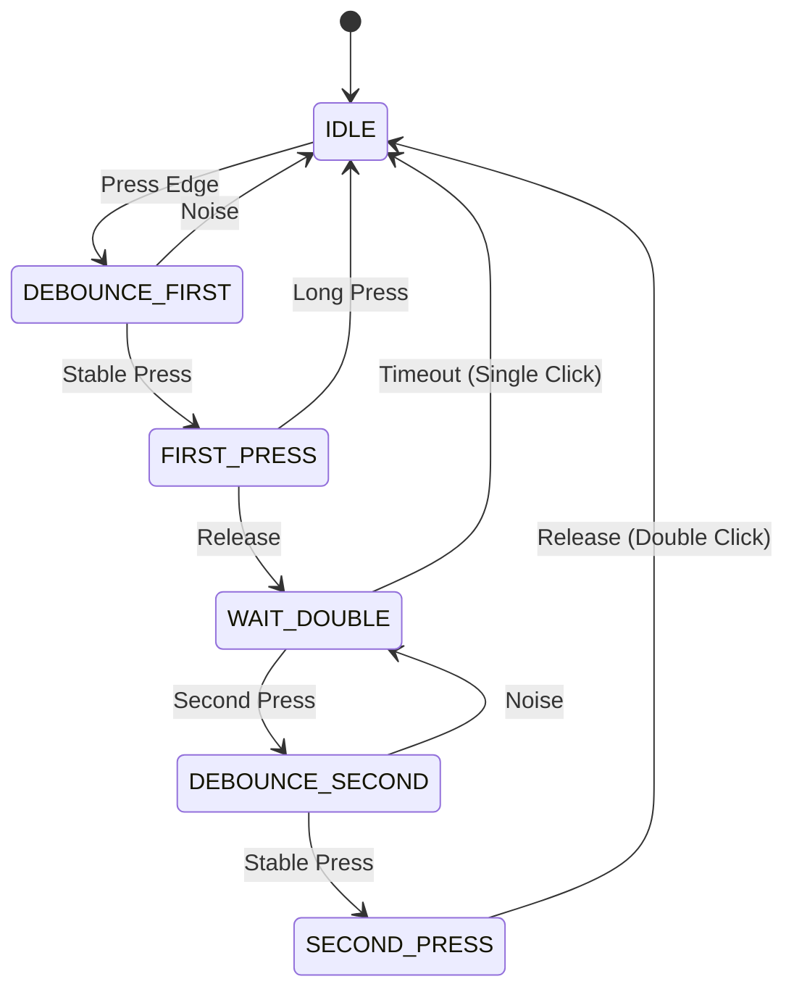
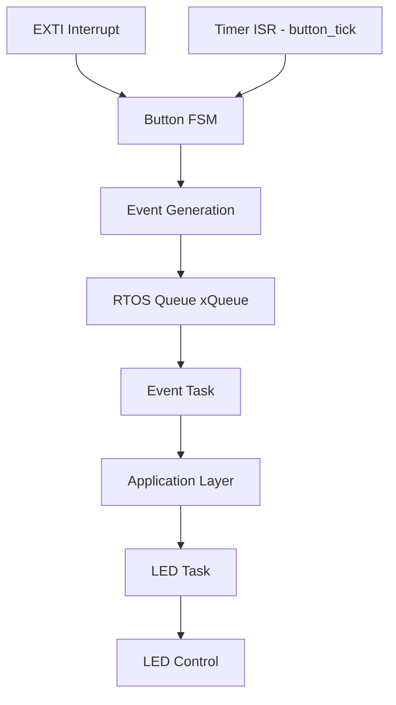

# STM32 Button Event System (Multi-Press Event Driven ,Timer Based FSM + RTOS Architecture)

### A production-style embedded system demonstrating FSM-based input handling, event-driven architecture, RTOS integration, and non-blocking multi-click detection on STM32.
------------------------------------------------------------------------

## Overview
This project demonstrates a *robust event-driven embedded system*
using:

- External Interrupts (EXTI) for button detection  
- Timer Interrupts for deterministic time tracking (debounce + duration)  
- State Machine for structured control  
- Event-driven logic for user interaction
- FreeRTOS for task-based execution

The system enforces a clear separation of:  
*Detection → Timing → Validation → Event Generation → Event Buffering → Action Execution*

Additionally, the design introduces:
- Modular button driver abstraction  
- State-based application control  
- Event queue for decoupled processing  
- Chunked event scheduling for fairness under load  
- Timer-driven FSM for deterministic behavior
- RTOS-based task scheduling (FreeRTOS)  
- Standardized ISR-to-queue event dispatch mechanism

## Hardware Setup
- Button → PC13 (EXTI Rising & Falling Edge)
  - External pull-up configuration:
     - Idle state → HIGH  
     - Button Press → LOW (Falling Edge)  
     - Button Release → HIGH (Rising Edge)  
- LED → PA5 (Output)  
- Timer → TIM2 (~20 ms debounce)  
- MCU → STM32F446RE

## System Evolution

This project evolved through multiple iterations to improve system reliability,
control flow, and architectural clarity.


### Version 1 — Basic State Machine (ISR-Driven)

- Implemented a simple state machine:
  - BUTTON_IDLE
  - BUTTON_PRESSED
- Debounce handled using timer interrupt
- State transitions and actions handled inside ISR

#### Limitations

- Logic tightly coupled inside interrupts
- Hard to scale for complex behaviors
- Difficult to debug and extend
- Violates best practice: heavy ISR processing


### Version 2 — Refactored State Machine (Main-Driven)

- Retained state machine concept but improved structure
- Moved decision-making and actions to main loop
- ISR used only for:
  - Event detection (EXTI)
  - Signal validation (Timer)

#### Improvements

- Clean separation of concerns
- Improved system predictability
- Easier debugging and maintenance
- Scalable for advanced features

### Version 3 — Event-Driven Architecture with Short & Long Press Handling

- Introduced event-based behavior:
  - EVENT_SHORT_PRESS
  - EVENT_LONG_PRESS
- Press duration measured using HAL_GetTick()
- Timing starts *after debounce validation*
- Actions triggered only in main loop

#### System Behavior

- *Short Press (< 2000 ms):*
  - LED toggles once
  - Action is triggered exactly once per press

- *Long Press (> 2000 ms):*
  - LED enters continuous toggle mode (non-blocking)
  - Behavior persists until next user interaction

#### Improvements

- Accurate press duration measurement  
- No duplicate or premature triggers  
- Clear separation between *state (validation)* and *event (action)*  
- Supports advanced features like long press  
- Non-blocking behavior for continuous actions


### Version 4 — Multi-Press Event Handling with Double Click Support

- Added event-based behavior:
  - EVENT_DOUBLE_CLICK

- Introduced new FSM states:
  - BUTTON_WAIT_DOUBLE
  - BUTTON_SECOND_PRESS

- Implemented *time-window based detection*:
  - Double click window: 1000 ms
  - Long press threshold: 2000 ms

- Event evaluation enhanced with *priority handling*:
  - LONG_CLICK > DOUBLE_CLICK > SHORT_CLICK

#### System Behavior

- Short Click (< 2000 ms):
  - Triggered only after double-click timeout expires
  - LED toggles once

- Long Click (> 2000 ms):
  - Highest priority event
  - Overrides double click detection
  - LED enters continuous toggle mode

- Double Click (two presses within 1 second):
  - Detected only after second release
  - LED toggles twice

#### Improvements

- Multi-stage event classification  
- Accurate interaction modeling based on user intent  
- Proper handling of second press with dedicated state  
- Eliminates premature double-click detection  
- Priority-based event resolution  
- Scalable foundation for multi-click and multi-button systems


### Version 5 — Modular Driver Abstraction with State-Based Output Handling

- Introduced button driver abstraction:
  
  - button.c / button.h
  - Encapsulates FSM, debounce, and event generation

- Application layer redesigned to separate:
  
  - Event handling (input interpretation)
  - State management (system behavior)
  - Output execution (LED control)

- Introduced state-based output control:
  
  - LED_IDLE
  - LED_BLINK

- Introduced action flags for transient behavior:
  
  - Single toggle
  - Double toggle

- Implemented state override mechanism:
  
  - Any new user input exits ongoing states (e.g., blinking)

#### System Behavior

- Short Click
  → Exit BLINK (if active)
  → Toggle LED once

- Double Click
  → Exit BLINK (if active)
  → Toggle LED twice

- Long Click
  → Enter BLINK state (continuous non-blocking toggle)

#### Improvements

- Clear separation of:
  
  - Driver (input handling)
  - Application (decision making)
  - Output (execution)

- Proper distinction between:
  
  - Event (instant trigger)
  - State (continuous behavior)

- Eliminates state overwrite issues

- Ensures all states have valid exit paths

- Improves scalability for multiple inputs and outputs

### Version 6 — Event Queue with Chunked Processing 

- Introduced event queue (circular buffer):
  
  - Decouples event production from consumption
  - Preserves event ordering

- Implemented producer–consumer model:
  
  - Button driver → produces events
  - Application layer → consumes events

- Added queue overflow handling:
  
  - Prevents system blocking
  - Allows controlled event dropping

- Introduced chunked event collection with resume index:
  
  - Handles queue full conditions gracefully
  - Ensures fair processing across all buttons
  - Avoids starvation

- Implemented processing scheduling loop:
  
  - Collect → Process → Resume

#### System Behavior

- Events are buffered before processing
- Queue ensures ordered and deterministic handling
- When queue is full:
  - Event collection pauses
  - Processing resumes
  - Remaining inputs are handled in next cycle

#### Improvements

- Eliminates event loss due to overwrite
- Decouples timing of input and processing
- Ensures fairness across multiple inputs
- Introduces back-pressure handling
- Enables scalable multi-button systems
- Prepares system for RTOS integration

### Version 7 — Simplified Timer-Driven FSM 

- Refactored FSM
- Introduced simplified and explicit states:
  - BUTTON_IDLE  
  - BUTTON_DEBOUNCE_FIRST  
  - BUTTON_FIRST_PRESS  
  - BUTTON_WAIT_DOUBLE  
  - BUTTON_DEBOUNCE_SECOND 
  - BUTTON_SECOND_PRESS  

- Introduced *timer-driven state progression*:
  - button_tick() updates:
    - debounce_time  
    - press_time  
    - release_time  
  - Driven by TIM2 interrupt for deterministic timing  

- Simplified ISR design:
  - EXTI only detects edge (press/release)  
  - No timing or decision logic inside ISR  

- Refactored FSM handling:
  - button_process() handles:
    - debounce validation  
    - state transitions  
    - event generation  

#### System Behavior

- *Short Click*
  - Triggered after double-click timeout  
  - LED toggles once  

- *Double Click*
  - Detected via second press within time window  
  - LED toggles twice  

- *Long Click*
  - Detected via press_time threshold  
  - LED enters continuous toggle mode

#### FSM Diagram (Button State Machine)


#### Improvements

- Deterministic timing using hardware timer  
- Eliminates dependency on main loop timing  
- Reduced FSM complexity and improved readability  
- Proper separation of ISR, timing, and logic  
- Improved reliability under system load  
- Production-style embedded architecture


### Version 8 — RTOS-Based Event System Integration (Current)

- Integrated FreeRTOS for task-based execution:
  
  - EventTask → Handles event processing  
  - LEDTask → Handles output behavior  

- Replaced custom queue with RTOS queue (xQueue):
  
  - Enables producer–consumer architecture  
  - Supports blocking and efficient CPU utilization  

- Introduced ISR-safe event dispatch:

  - button_queue_event_from_isr()  
  - Standardized event propagation from ISR to tasks  

- Refactored event flow:

  - ISR → Queue → EventTask → Application → Output  

- Fixed event propagation gap:

  - Ensured all event paths (including SINGLE_CLICK) are queued consistently  

#### System Behavior

- Events generated in driver layer are immediately queued from ISR  
- EventTask blocks on queue and processes events on arrival  
- LEDTask executes output behavior independently  
- System remains responsive and non-blocking under load  

#### Improvements

- Decouples ISR from application logic using RTOS queue  
- Eliminates missed event propagation issues  
- Improves responsiveness via immediate task wake-up  
- Enables scalable multi-task architecture  
- Establishes production-style ISR-to-task communication pattern  
- Aligns system with real-world RTOS-based firmware design
---
## Key Features
- Interrupt-driven button handling (EXTI)
- Timer-driven debounce and timing model
- State machine-based signal validation
- Event-driven architecture
- Clean separation of ISR and main loop
- Short press detection  
- Long press detection (> 2 seconds)  
- Double click detection (< 1 second window)  
- Multi-stage FSM handling  
- Non-blocking LED behavior
- Deterministic and stable behavior
- Scalable multi-button design
- Event queue buffering
- Producer–consumer design
- Chunked event scheduling

## System Architecture


## System Flow

```md
## System Flow
Button Press (PC13)  
→ EXTI Interrupt Triggered  
→ FSM state transition  

Timer Interrupt (TIM2)  
→ Updates debounce_time / press_time / release_time  

Event Generation (Driver Layer)  
→ Event classified (SHORT / LONG / DOUBLE)  
→ button_queue_event_from_isr() pushes event to RTOS queue  

EventTask (RTOS)  
→ Blocks on queue (xQueueReceive)  
→ Processes incoming events  
→ Updates application state  

LEDTask (RTOS)  
→ Executes output behavior  
→ Maintains non-blocking LED control
```
## Advantages
- Deterministic and stable system behavior
- Clean separation of detection, timing, validation, and action
- Decoupled architecture using event buffering (queue)
- Fair processing across multiple inputs under load
- Non-blocking design ensuring responsive system execution
- Scalable for multi-button and multi-event systems
- Robust handling of edge cases and overflow conditions
- Modular and extensible architecture for future enhancements
- RTOS-based decoupling of execution and event handling
- Immediate event-driven task wake-up (low latency)
- Eliminates event propagation inconsistencies
- Aligns with production-grade embedded system design patterns

## Considerations
- ISR kept minimal (edge detection only) to avoid blocking scheduler and ensure low interrupt latency  
- Timer defines system timing resolution; all time-based logic depends on tick accuracy  
- FSM ensures valid transitions and prevents invalid state behavior  
- RTOS task priorities must be carefully configured to avoid starvation of lower priority tasks  
- Blocking calls (e.g., xQueueReceive) must be used judiciously to balance responsiveness and periodic processing  
- Queue size must be tuned to prevent overflow under burst inputs while minimizing memory usage  
- Event propagation must be consistent across all paths (e.g., ISR → queue) to avoid silent failures  
- Shared resources between ISR and tasks must be handled safely to avoid race conditions

## Learning Outcomes
- EXTI interrupt handling and timer-based debounce design
- Timer-driven debounce and time-based event detection
- Finite State Machine (FSM) implementation for input validation
- Clear separation of state (behavior) vs event (trigger)
- Event-driven system design with non-blocking execution
- Modular driver abstraction and layered architecture design
- Multi-click interaction modeling (short, long, double press)
- Circular buffer (event queue) and producer–consumer pattern
- Fair scheduling and back-pressure handling under system constraints
- Scalable and deterministic embedded system design
- RTOS integration (FreeRTOS) in embedded systems
- Task-based system design and scheduling
- ISR-to-task communication using queues (xQueueSendFromISR)
- Blocking vs non-blocking behavior in RTOS systems
- Designing robust event propagation mechanisms


## Support

If you found this useful:
- ⭐ Star the repo
- 🍴 Fork it
- 🧠 Use it in your own projects

#### It helps others discover this work!
---

## Author
Vivek Shenoy K\
Embedded Software Architect
